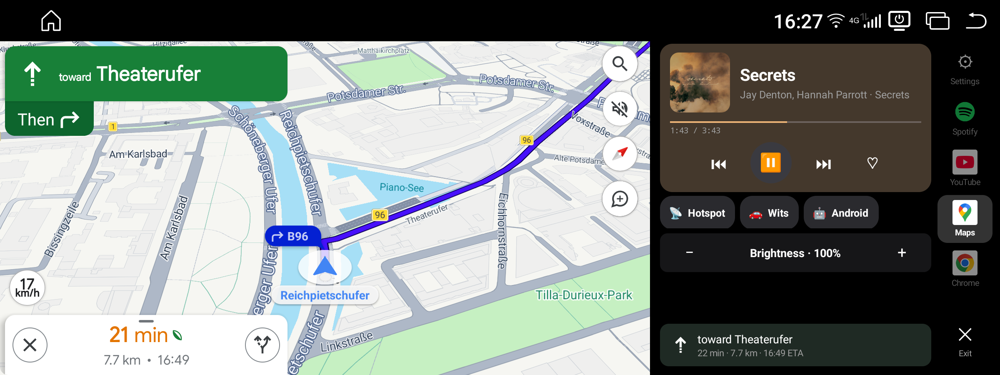
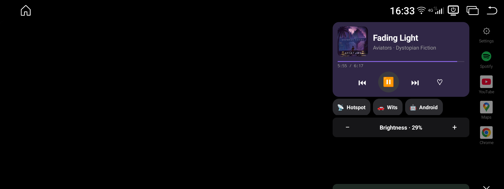
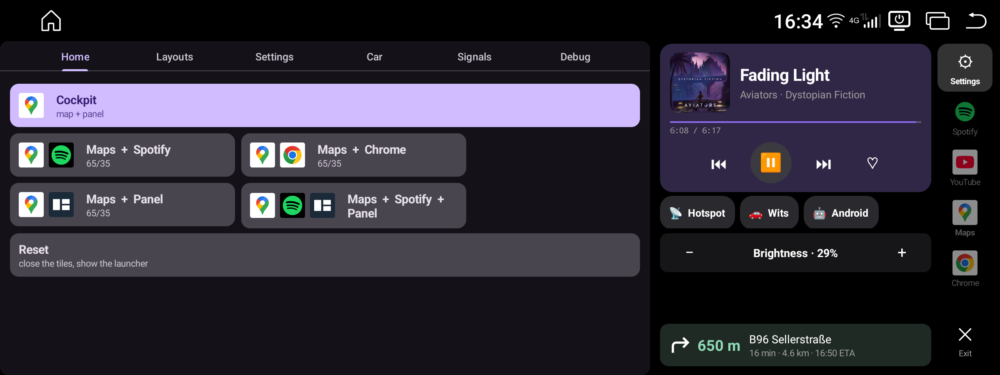

# Wits Companion

A companion app for Witstek / XTRONS Android head units (developed against a
QWBX24NB12X3 in a BMW X3 F25, 2400×900 display, Android 13).

Stock firmware gives you one app at a time on a very wide screen. This app adds a
**Cockpit**: a driving surface that puts a map (or any app) in one tile and a control
panel — media, brightness, hotspot, app switcher — in the other, side by side.

## What it does

- **Cockpit** — two freeform tiles: a floating app on one side, the companion's own
  control panel on the other. Tap a rail tile to switch the floating app, tap the
  active one again to hide it.
- **Tiled presets** — arbitrary two-app layouts (Maps + Chrome, …) with a single
  shared split ratio and a swap.
- **Autostart** — re-apply the last layout when the unit powers up (ignition / boot),
  and optionally when the app is opened. Every automatic trigger is opt-in and refused
  while reverse is engaged.
- **Media** — transport for whatever is playing via the standard MediaSession API,
  album-art tinting, and a media-key fallback that can start a player that has no live
  session yet.
- **Panel controls** — brightness, Wi-Fi hotspot toggle with state restore, day/night.

## What it looks like

The Cockpit: a floating app in one tile, the control panel in the other. The panel carries
media transport, brightness, the hotspot toggle, shortcuts into the vendor's car settings and
plain Android settings, and a rail to switch the floating app.



Tapping the lit rail tile hides the floating app. The panel takes the whole display and paints
the freed strip black, keeping its controls where your hand already expects them.



The gear opens the configuration in the Cockpit's *left* tile — the slot the map usually
occupies — so the panel stays live beside it and nothing goes full-screen.



## Two build variants

| Variant | Signing | Window path |
|---|---|---|
| `debug` | ordinary debug key | the vendor `wits.intent.action.CHANGE_WINDOW` broadcast hook |
| `platform` | **platform key** | privileged `IActivityTaskManager` (`resizeTask`, task removal) — no flicker, real feedback |

The privileged path is what makes tiles land exactly and silently, but it requires the
**platform signing key of your own unit**, which is *not* in this repository and never
will be. Without it the app still works through the vendor hook.

Nothing here roots the device, flashes an OTA, or touches `system` / `vendor` /
boot / AVB. It is an ordinary `/data` app that uses APIs the shipped firmware already
exposes.

## Build and deploy

```sh
./wits-companion/gradlew -p wits-companion :app:assembleDebug
./wits-companion/gradlew -p wits-companion :app:testDebugUnitTest

tools/deploy.sh debug                    # -> first emulator
tools/deploy.sh platform <serial|ip:port>  # -> the head unit, platform-signed
```

JDK 17 and Android SDK platform 35. Always use the wrapper — AGP 8.x does not work
with a system Gradle 9.x.

CI runs the same four commands on every push: unit tests, lint for both modules, and both
debug assemblies. Tagging `v*` additionally builds the platform-signed APK and attaches it
to a GitHub release — deliberately only on a tag, because that artifact is an installable,
system-privileged app rather than source and notes.

The platform keystore is read from `WITS_PLATFORM_KEYSTORE`, or
`tools/platform-key/platform.keystore.p12` — a path that is git-ignored.

## Layout

```
wits-companion/   the Android app (Gradle project)
tools/            build, deploy, emulator setup, layout probes
docs/             engineering notes on how and why it works
```

Start with [`docs/window-management.md`](docs/window-management.md) — the windowing
model, what the ROM does and does not support, and the diagrams for the Cockpit state
machine and window layering.

## A note on the research tree

This repository holds the app and the notes that explain it. The firmware analysis it
grew out of — decompiled vendor code, full device captures, logs — stays **private**:
it contains vendor binaries that are not mine to redistribute and captures with device
and personal identifiers.

Some documents therefore cite paths (`analysis/…`, `research/…`, a few `docs/…`) that
are not published here. Those references are left intact rather than scrubbed, so the
reasoning stays honest and traceable for me; they are simply not resolvable from a
clone.

## Status

Personal project, developed and verified on one vehicle. Behaviour is specific to this
vendor's firmware and will differ on other units. No warranty — you are modifying the
software of a device you drive with.

## License

[MIT](LICENSE) — use it, fork it, change it, ship it. Just keep the copyright notice,
and note the "as is, no warranty" clause: this drives a device in a car.
