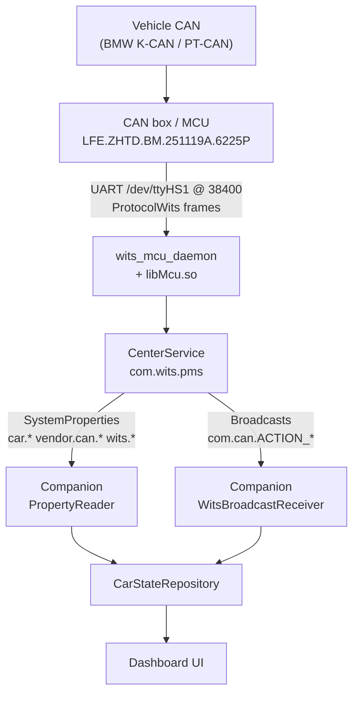
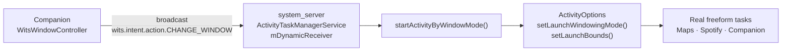
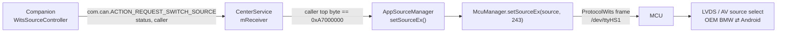
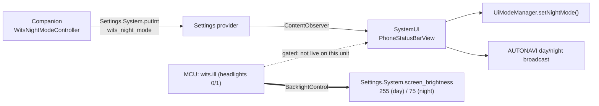
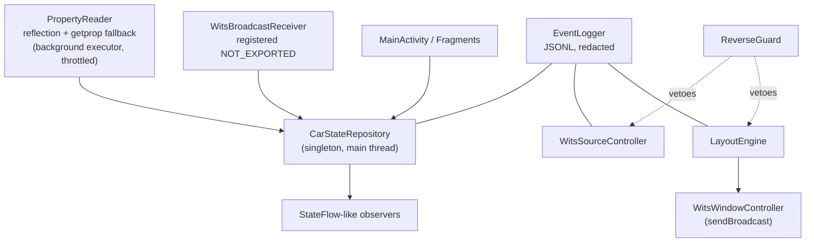

# Architecture

How vehicle data reaches Android, and how the companion talks back — with the exact
components involved and their confidence level.

---

## 1. Inbound: vehicle → companion

There is **no SocketCAN interface on this device**. `PF_CAN` / `AF_CAN` / `can0` do not
appear anywhere in `vendor/bin` or `vendor/lib*` `[NOTFOUND]`. All vehicle data is
mediated by the **MCU over a serial line**.

**Evidence**

| Element | Evidence |
|---|---|
| Serial device `/dev/ttyHS1`, 38400 baud | `McuManager.java:451` `mMcu.openSerialPort(new File("/dev/ttyHS1"), 38400)` `[CODE]` |
| Second port `/dev/ttyHS2` | `McuManager.java:457` `[CODE]` |
| Native daemon opens the same port | `vendor/bin/wits_mcu_daemon` strings: `/dev/ttyHS1`, `## open serial %s error %d`, `persist.wits.fake_read_can` `[CONF]` |
| Frame format | `com/common/util/ProtocolWits.java` `[CODE]` — see `mcu-protocol.md` |
| Properties published | `com/middle/UtilExport.java` (`PROP_*` constants) `[CODE]` |
| Broadcasts published | `UtilExport.sendIllStatus` :621, `sendRealReverseState` :557, etc. `[CODE]` |
| No SocketCAN | grep over `vendor/bin`, `vendor/lib`, `vendor/lib64` `[NOTFOUND]` |

**Consequence:** the companion can only observe what CenterService chooses to publish.
It cannot read arbitrary CAN IDs.

---

## 2. Outbound: companion → window layout

The layout path does **not** involve the MCU at all. It is a vendor patch inside
`system_server`.

**Evidence**

| Element | Evidence |
|---|---|
| Receiver registration, **no permission argument** | `ActivityTaskManagerService.java:511-514` `[CODE]` |
| Action dispatch | `ActivityTaskManagerService.java:401` (`CHANGE_WINDOW`), `:410` / `:412` (`MOVE_PIP_WINDOW`, `..._BACK`) `[CODE]` |
| Window placement | `ActivityTaskManagerService.java:480-483` `setLaunchWindowingMode(i)` + `setLaunchBounds(new Rect(...))` `[CODE]` |

Because the receiver is registered without a permission, **any installed app can send
these broadcasts**. That is what makes a non-privileged companion possible — and it is
also a security property worth understanding (see `security.md`).

---

## 3. Outbound: companion → OEM/Android source

**Evidence**

| Element | Evidence |
|---|---|
| Action constant | `UtilExport.java:61` `com.can.ACTION_REQUEST_SWITCH_SOURCE` `[CODE]` |
| Extras built | `UtilExport.java:344-345` `putExtra("status", source)`, `putExtra("caller", (caller & 255) \| TAG_WITS_APP)` `[CODE]` |
| Magic constant | `UtilExport.java:157` `TAG_WITS_APP = -1493172224` (= `0xA7000000`) `[CODE]` |
| Server-side check | `CenterService.java:1876-1878` reads `caller`, requires `(caller & 0xFF000000) == 0xA7000000` and `source != 0` `[CODE]` |
| Dispatch to MCU | `AppSourceManager.java:482` `setSourceEx(index, caller)` → `McuManager.setSourceEx(source, 243)` `[CODE]` |

The "magic" is **obfuscation, not authorisation** — any app can set that byte. `[CODE]`

**Source IDs** (`UtilExport.AppMode`) `[CODE]`: `CAN = 41` (OEM/original car),
`LAUNCHER = 241` (Android), `NAVI = 40`, `MUSIC = 38`, `AUX = 5`, `BACKCAR = 11`,
`SETTINGS = 242`, `CENTER = 243`.

---

## 4. Outbound: companion → day/night

No MCU involvement; this is pure Android settings.

**Evidence:** `PhoneStatusBarView.java:1245-1270` observes `wits_night_mode` and maps
`0 → follow wits.ill`, `1 → time schedule`, `2 → force night`, `3 → force day` `[CODE]`.
`setThemeByIll()` at `:616` reads sysprop `wits.ill` `[CODE]`.

**But on this unit the dotted edge does not fire, and the solid one does.** The ILL→theme
path is gated on `UiSettings == "witstek8" && wits_night_mode == 0`; both are unset, so the
theme never moves — it is separately *locked* on night. What the headlights actually drive is
the **backlight**, via `BacklightControl` swapping `screen_brightness` between
`screen_brightness_day` and `_night`. `[RUNTIME]` 2026-08-20

So this diagram shows what the companion *writes*, not what the driver *sees* change. Day/night
is three separate mechanisms here — see `night-mode.md`, which leads with them.

---

## 5. Component ownership map

| Layer | Component | Partition | Signed by | Companion interaction |
|---|---|---|---|---|
| Vehicle bus | MCU firmware | — | vendor | none (indirect only) |
| Serial bridge | `wits_mcu_daemon`, `libMcu.so` | `vendor` | vendor | none |
| Car service | `CenterService` (`com.wits.pms`) | `system/priv-app` | platform `c8a2e9bc…` | broadcasts in/out |
| Camera/AUX | `MiscService` (`com.wits.misc`) | `system/priv-app` | platform | observe only |
| Window mgmt | `services.jar` → `ActivityTaskManagerService` | `system/framework` | platform | `CHANGE_WINDOW` |
| Day/night UI | `SystemUI` | `system_ext/priv-app` | platform | `Settings.System` |
| Launcher | `WitsLauncher` (`com.wits.launcher`) | `system/app` | platform | none (coexist) |
| **Companion** | `io.github.miklergm.witscompanion` | `/data` | own debug key | — |

The companion is an ordinary `/data` app. It holds **no** platform permissions and
cannot be granted `android.uid.system`. `[CODE]` — platform cert
`c8a2e9bccf597c2fb6dc66bee293fc13f2fc47ec77bc6b2b0d52c11f51192ab8` signs
`android` + all Wits apps (`analysis/out/signing-certificates.csv`).

---

## 6. Why not TaskView / ActivityView

- `ActivityView` was removed in Android 13 `[NOTFOUND]` in `analysis/jadx/framework`.
- `TaskView` exists but lives **inside the SystemUI process**
  (`analysis/jadx/SystemUI/sources/com/android/wm/shell/TaskViewFactoryController.java`)
  `[CODE]`. `TaskViewFactory` is not reachable from a normal `/data` app.

Therefore the companion **orchestrates sibling freeform tasks** next to its own window
rather than embedding foreign activities inside its view hierarchy. This is the
architectural decision that shapes the whole layout engine.

---

## 7. Threading / process model in the companion

Design rules:

- Property polling is **throttled and never a tight loop** (`getprop` subprocess is a
  fallback only; see `known-unknowns.md` §5).
- Every state-changing action goes through `ActionRateLimiter` and is logged.
- `ReverseGuard` can veto both layout application and source switching.
