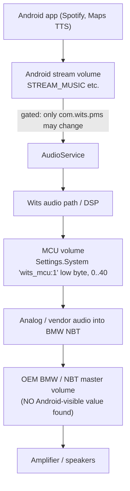

# Audio and volume domains

The single most consequential finding of this workstream:

> **This firmware patches `AudioService` so that every volume change is ignored unless
> the caller is `com.wits.pms` (CenterService).** `[CODE]`

That one patch explains the missing volume OSD, why the companion cannot set volume, and
why the volume chain behaves the way it does.

---

## 1. The AudioService gate

`analysis/jadx/services/sources/com/android/server/audio/AudioService.java`
(from `system/system/framework/services.jar`).

### 1.1 `adjustSuggestedStreamVolume` — the volume-key path

```java
// AudioService.java:2219   [CODE]
if (str == null || !str.contains("com.wits.pms")) {
    Log.i("AS.AudioService", "## ignore adjustSuggestedStreamVolume from " + str);
    return;
}
```

`str` is the calling package. This method is what hardware volume keys and
`AudioManager.adjustSuggestedStreamVolume()` end up in. **Only `com.wits.pms` passes.**
Note `com.android.settings` is *not* whitelisted here.

The `return` happens **before** any of the volume-dialog / `FLAG_SHOW_UI` logic, so no
UI is triggered either.

### 1.2 `adjustStreamVolumeWithAttribution`

```java
// AudioService.java:2273   [CODE]
if (str != null && !str.contains("com.wits.pms") && !str.contains("com.android.settings")) {
    Log.i("AS.AudioService", "## ignore adjustStreamVolumeWithAttribution for " + str);
    return;
}
```

### 1.3 `setStreamVolume`

```java
// AudioService.java:2969   [CODE]
if (str != null && !str.contains("com.wits.pms") && !str.contains("com.android.settings")) {
    Log.i("AS.AudioService", "## ignore setStreamVolume for " + str);
    return;
}
```

### 1.4 Consequences

| Consequence | Confidence |
|---|---|
| A normal app (incl. our companion) **cannot change Android stream volume** — calls are silently dropped | `[CODE]`, needs `[RUNTIME]` confirmation |
| **Reading** volume is unaffected — `getStreamVolume`, `getStreamMaxVolume`, `getStreamVolumeDb` are not gated | `[CODE]` |
| The AOSP volume dialog cannot appear from a normal volume adjustment, because the request returns before UI handling | `[CODE]` |
| Only CenterService can move Android volume, so the whole Android volume domain is effectively MCU-driven | `[HYP-strong]` |
| The `logcat` marker `## ignore ...` is a **reliable runtime probe** for this behaviour | `[CODE]` |

> **Runtime check:** `adb logcat -s AS.AudioService | grep "## ignore"` while pressing a
> volume control. Included in `tools/capture-audio-snapshot.sh`.

---

## 2. Volume domains

There are at least four distinct domains. Never conflate them.



| # | Domain | Android-visible value | Evidence |
|---|---|---|---|
| 1 | **Android stream volume** | `AudioManager.getStreamVolume(stream)` | AOSP `[CODE]` |
| 2 | **Wits/MCU volume** | `Settings.System["wits_mcu:1"] & 0xFF`, range 0..40 | `[CODE]` §3 |
| 3 | **MCU mute** | `Settings.System["wits_mcu:040401"]` (`MCU_VOLUME_MUTE`) | `[CODE]` |
| 4 | **OEM BMW / NBT master volume** | **none found** | `[NOTFOUND]` §4 |

---

## 3. The MCU volume value — an absolute value **does** exist

`analysis/jadx/CenterService/sources/com/my/manager/McuManager.java`

```java
// :1656-1664   [CODE]
public void setVolume(int vol) {
    if (GlobalDef.isM701() || GlobalDef.isYA8232()) {
        MAX_VOLUME = 40;
        int i = UtilSetting.getIntProperty(mContext, UtilSetting.MCU_VOL1);
        UtilSetting.setIntProperty(mContext, UtilSetting.MCU_VOL1, (i & 0xFFFFFF00) | vol);
        return;
    }
    UtilSetting.setIntProperty(mContext, UtilSetting.MCU_VOLUME, vol);
}

// :1679-1686   [CODE]
private int getCurVolume() {
    if (GlobalDef.isM701() || GlobalDef.isYA8232()) {
        MAX_VOLUME = 40;
        return UtilSetting.getIntProperty(mContext, UtilSetting.MCU_VOL1) & 255;
    }
    return UtilSetting.getIntProperty(mContext, UtilSetting.MCU_VOLUME);
}
```

Key constants (`UtilSetting.java`) `[CODE]`:

| Constant | Settings.System key | Meaning on M701 |
|---|---|---|
| `MCU_VOL1` | `wits_mcu:1` | **packed**; low byte = current volume 0..40 |
| `MCU_VOL_CALL` | `wits_mcu:2` | call volume |
| `MCU_VOLUME` | `w19_mcu:040400` | volume on the W19 platform (not M701) |
| `MCU_VOLUME_MUTE` | `wits_mcu:040401` | mute flag |

**Our device is M701**, so the live value is `Settings.System["wits_mcu:1"] & 0xFF`,
`MAX_VOLUME = 40`. `[CODE]`

Default from `ConfigM701.MCU_DEFAULT_SETTINGS_M701` is `7702` = `0x1E16` → low byte
`0x16` = 22 `[CODE]`. The high byte is a second packed field whose meaning is `[HYP]`.

`setVoulumeIncrease(boolean up)` (`:1687-1700`) is the relative step: read
`getCurVolume()`, ±1 clamped to `0..MAX_VOLUME`, clear mute if raising from 0, write
back `[CODE]`.

### 3.1 The MCU also reports volume back

```java
// McuManager.java:874-878   [CODE]
if (param.length > 8 && param[8] >= 0 && param[8] <= 80 && this.mVolume != param[8]) {
    this.mVolume = param[8];
    UtilSetting.setIntProperty(mContext, UtilSetting.MCU_VOLUME, param[8]);
}
```

So the MCU pushes an absolute level (0..80 range check) into a Settings key. This branch
writes `MCU_VOLUME` (`w19_mcu:040400`) — the **W19** key, not the M701 one. Whether the
M701 message path populates `wits_mcu:1` from the MCU in the same way is **`[HYP]`** and
is exactly what the Signal Explorer must settle.

**Therefore: is the MCU volume readable in real time on this device?**
`[HYP]` — probable, but must be confirmed by watching `wits_mcu:1` (and
`w19_mcu:040400`) with `SettingsProbe` while turning the knob.

---

## 4. The OEM / NBT volume — not found

Searched across CenterService, MiscService, SystemUI, services.jar, framework.jar,
WitsSettings, WitsLauncher and the vendor property namespace for any absolute OEM/NBT
volume value.

| What was searched | Result |
|---|---|
| A property or Settings key holding an OEM/NBT master volume | `[NOTFOUND]` |
| A broadcast carrying an absolute OEM volume | `[NOTFOUND]` |
| An MCU report field documented as OEM volume | `[NOTFOUND]` |

What *does* exist is a **relative** notification:

```java
// UtilExport.java:592-598   [CODE]
Intent it = new Intent(ACTION_VOLUME_CHANGE);       // "com.can.ACTION_VOLUME_CHANGE"
it.putExtra(EXTRAS_KEY_CODE, vol);                  // extra "key_code"
it.putExtra(EXTRAS_KEY_STATUS, mute);               // extra "key_status"
it.setPackage(PACKAGE_DO_CAN_PACKAGE);              // targeted at com.wits.autocan
```

Two caveats:

1. It is **`setPackage`-targeted at `com.wits.autocan`**, which is **not installed** on
   this firmware `[CONF]`. A companion will therefore very likely **not** receive it.
   `[HYP]` — the Explorer will confirm.
2. Whether `key_code` here is an absolute level or a key/direction code is **`[HYP]`**.
   The extra name (`key_code`) suggests a key code, not a level.

> **Rule, per the brief:** until an absolute OEM value is proven, the companion must show
> the OEM/NBT domain as `UNKNOWN`. Never integrate `Volume+/-` events into a counter and
> present it as exact. See §7.

---

## 5. Why there is no standard Android volume OSD

Both UIs exist in this SystemUI build:

| Class | Path | Role |
|---|---|---|
| `VolumeUI` | `com/android/systemui/volume/VolumeUI.java` | AOSP starter, still registered in the dagger startable map (`DaggerGlobalRootComponent.java:4750`) `[CODE]` |
| `VolumeDialogImpl` | `com/android/systemui/volume/VolumeDialogImpl.java` | AOSP dialog, present `[CODE]` |
| **`WitsVolumeDialog`** | `com/android/systemui/qs/tiles/dialog/WitsVolumeDialog.java` | **vendor replacement** `[CODE]` |

### 5.1 The vendor dialog and its gates

```java
// PhoneStatusBarView.java:256-300   [CODE]
static void showVolumeDialog(PhoneStatusBarView v) {
    String uiName = Settings.System.getString(cr, "UiName");
    if ((isEmpty(uiName) || !"WITS_SNPQ8_2mode".equals(uiName)) && v.volumeDialog == null)
        v.volumeDialog = new WitsVolumeDialog();

    int hideForever = "X22".equals(SystemProperties.get("ro.wits.product.ex"))
        ? 1 : parseInt(SystemProperties.get("wits.systemui.hide.volume_forever"));

    if (hideForever == 1) {
        sendBroadcast("com.wits.launcher.ACTION_OPENVOLUME");   // launcher shows its own panel
        return;
    }
    int hide = parseInt(SystemProperties.get("wits.systemui.hide.volume"));
    ... // dialog construction, WindowManager type 2020
}
```

Triggers for `showVolumeDialog` `[CODE]`: broadcast **`com.wits.systemui.show_volume`**
(`:673`, filter registered `:833`), the QS tile `CSPVolumeTile`, and `:1107`.

### 5.2 The properties

| Property | Meaning | Set where |
|---|---|---|
| `wits.systemui.hide.volume` | gate for the Wits dialog | **set to `"1"` at MCU init on M701** — `McuManager.java:464` `[CODE]` |
| `wits.systemui.hide.volume_forever` | `1` ⇒ delegate to the launcher panel | `[CODE]` |

```java
// McuManager.java:462-465   [CODE]
if (GlobalDef.isM701() || GlobalDef.isYA8232()) {
    UtilExport.setProp(UtilExport.PROP_SYSTEMUI_HIDE_VOLUME, MachineConfig.VALUE_ON); // "1"
}
```

`MSG_UNLOCK_SHOW_SYSTEMUI_VOLUME` (msg 6) later sets it back to `"0"`
(`McuManager.java:354-355`) `[CODE]`.

> **Honest caveat:** the decompiled branch at `PhoneStatusBarView.java:288-290` is
> `if (parseInt2 == 0 || (dialog = ...) == null) { }` — an **empty body**, which is a
> jadx artifact where a `return` was lost. The exact polarity of
> `wits.systemui.hide.volume` (`1` = hide vs `1` = allow) is therefore **`[HYP]`**.
> The property name and the boot-time value on M701 make "1 = hide" the natural reading,
> and it matches the reported symptom — but read the live value with
> `tools/capture-audio-snapshot.sh` before asserting it.

### 5.3 Decision tree

Use the Signal Explorer to place your device on this tree:

```
Press a volume control, then check:

A. Android stream changed (AudioProbe delta != 0)?
   ├─ YES, and no dialog appeared
   │    → SystemUI/dialog suppression.
   │      Check wits.systemui.hide.volume / _forever, and whether
   │      com.wits.systemui.show_volume was broadcast.
   └─ NO
        B. A Wits key broadcast arrived (com.can.ACTION_KEY_CODE ...)?
           ├─ YES → the key was routed away from AudioService
           │        (MCU/OEM path, or CenterService consumed it).
           │        Look for "## ignore adjust..." in logcat: if present, the
           │        AudioService gate rejected somebody's attempt.
           └─ NO
                C. Did wits_mcu:1 / w19_mcu:040400 change (SettingsProbe)?
                   ├─ YES → MCU-domain change with no Android involvement.
                   └─ NO  → OEM-only path; nothing is visible to Android.
                            Expect only the BMW OSD to move.
```

---

## 6. Per-source volume storage

`Settings.System` keys, written by CenterService `[CODE]`:

| Key | Constant | Domain |
|---|---|---|
| `audio_source_arm` | `KEY_VOL_SYS` | Android/system source |
| `audio_source_bt` | `KEY_VOL_BT` | Bluetooth |
| `audio_source_fm` | `KEY_VOL_FM` | radio |
| `audio_source_dvd` | `KEY_VOL_DVD` | DVD |
| `audio_source_auxin` | `KEY_VOL_AVIN` | AUX in |
| `audio_source_tv` / `audio_source_dab` | `KEY_VOL_TV` / `KEY_VOL_DAB` | TV / DAB |
| `Android_media_vol`, `Android_phone_vol` | — | Android media / phone |
| `Car_navi_vol`, `Car_phone_vol` | — | navigation / phone mixing |
| `def_wits_vol`, `KEY_DEFAULT_VOL` | `KEY_DEFAULT_VOL*` | power-on default |
| `w19_total_volume`, `w19_bt_volume` | — | W19 platform only |
| `key_x22_volume_android`, `key_x22_volume_car` | — | X22 platform only |
| `naviMixMediaVolume` | `SYSTEM_NAV_MIX` | nav/media ducking |
| `wits_hide_status_bar_volume_icon` | — | status-bar icon |

These are **candidates**; which ones this BMW profile actually maintains is `[HYP]` until
the SettingsProbe diff shows them changing.

---

## 7. Truthful presentation rules (implemented in the app)

`VolumeDomain` in `signalexplorer/AudioProbe.kt` distinguishes:

| Domain | Shown as | Rule |
|---|---|---|
| `ANDROID_MEDIA` | `11 / 15` | real `AudioManager` value |
| `ANDROID_OTHER_STREAMS` | per stream | real values |
| `WITS_MCU` | `22 / 40` | only if `wits_mcu:1` is readable; otherwise `—` |
| `OEM_NBT` | **`value unavailable`** | never a number until an absolute source is proven |
| `OEM_RELATIVE_ESTIMATE` | `≈ +3 steps since reset` | **opt-in**, explicitly labelled an estimate, user-resettable, never called exact |

The app will **not** display `0` for a domain it has not read.

---

## 8. What the companion must not do

- Do not call `setStreamVolume` / `adjustStreamVolume` — they are gated and would fail
  silently, producing a misleading UI. `[CODE]`
- Do not send `com.wits.systemui.show_volume` in the observation milestone (it is a TX to
  SystemUI; harmless but out of scope).
- Do not write any `wits_mcu:*` Settings key. Writing `wits_mcu:1` would command the MCU
  through the ContentObserver in `ConfigM701` `[CODE]` — that is a control action, not
  observation, and is explicitly out of scope.

---

## 9. Runtime questions this must answer

| # | Question | Method |
|---|---|---|
| A1 | Is `wits_mcu:1` present and does its low byte track the volume? | SettingsProbe diff while stepping volume |
| A2 | Does the MCU push volume back (does the value change when only the NBT knob is used)? | same, with `NBT_KNOB_VOLUME_UP` markers |
| A3 | Do Android streams change on a steering Volume+? | AudioProbe before/after |
| A4 | Does `## ignore adjust...` appear in logcat? Which caller? | `capture-audio-snapshot.sh` |
| A5 | Is `com.can.ACTION_VOLUME_CHANGE` receivable despite `setPackage`? | BroadcastProbe |
| A6 | Which of the `audio_source_*` keys move? | SettingsProbe diff per source |
| A7 | Live value/polarity of `wits.systemui.hide.volume` | PropertyProbe |
| A8 | Does the Wits dialog appear for any control? | user-observed marker field |
