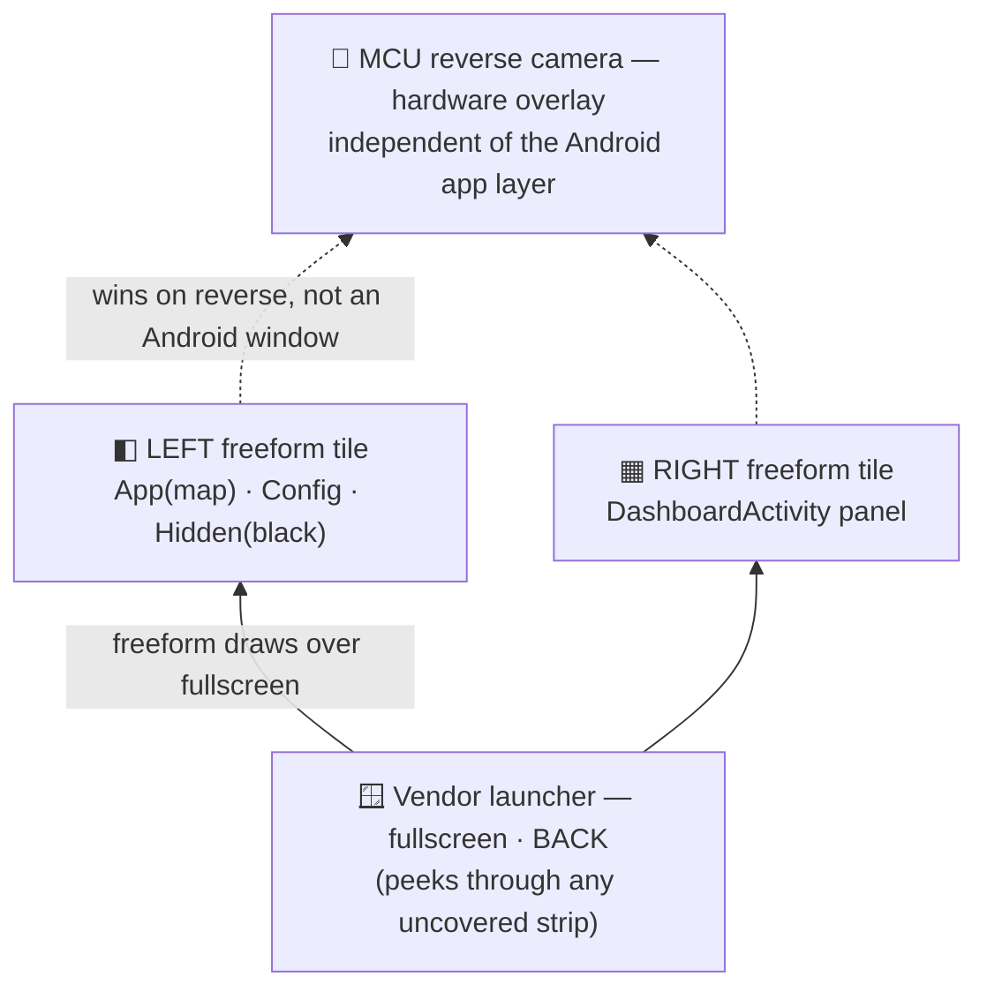
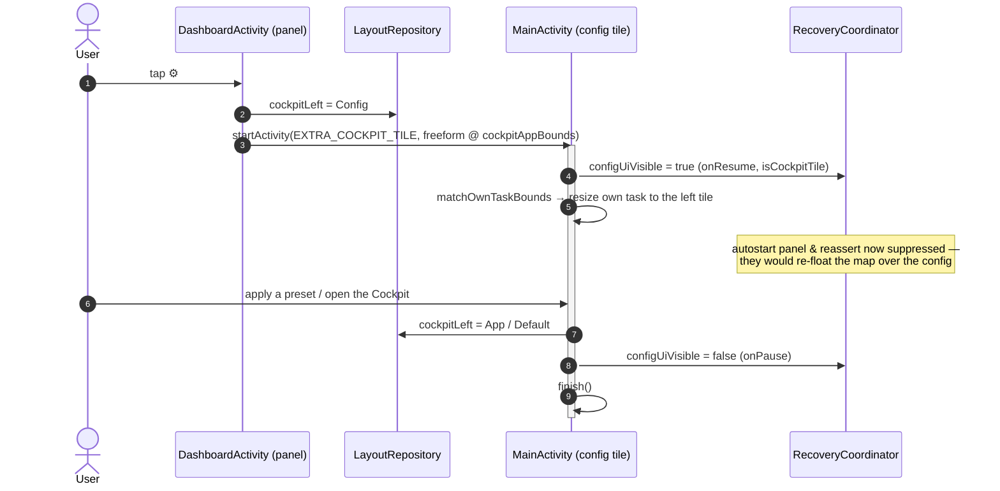

# Window management — `wits.intent.action.CHANGE_WINDOW`

The single most important vendor hook for this project. It is a **patch in
`system_server`**, not a launcher feature.

Source of truth:
`analysis/jadx/services/sources/com/android/server/wm/ActivityTaskManagerService.java`
(from `system/system/framework/services.jar`).

---

## 1. The hook

### Registration — unprotected

```java
// ActivityTaskManagerService.java:508-514   [CODE]
IntentFilter intentFilter = new IntentFilter();
intentFilter.addAction("wits.intent.action.CHANGE_WINDOW");
intentFilter.addAction("wits.intent.action.MOVE_PIP_WINDOW");
intentFilter.addAction("wits.intent.action.MOVE_PIP_WINDOW_BACK");
this.mContext.registerReceiver(this.mDynamicReceiver, intentFilter);
```

`registerReceiver` is called **without a `broadcastPermission` argument**, inside the
`system_server` context, during `onSystemReady()`. Any app on the device can therefore
send these broadcasts. `[CODE]`

### Dispatch

```java
// ActivityTaskManagerService.java:401-408   [CODE]
if (intent.getAction().equals("wits.intent.action.CHANGE_WINDOW")) {
    String stringExtra = intent.getStringExtra("packageName");
    if (stringExtra == null || stringExtra.equals("")) return;
    Display display = mRootWindowContainer.getDefaultDisplay().getDisplay();
    startActivityByWindowMode(
        stringExtra,
        intent.getIntExtra("windowMode", 1),
        intent.getIntExtra("left",   0),
        intent.getIntExtra("top",    0),
        intent.getIntExtra("right",  display.getWidth()),
        intent.getIntExtra("bottom", display.getHeight()));
}
```

### Implementation

```java
// ActivityTaskManagerService.java:480-494   [CODE]
public void startActivityByWindowMode(String pkg, int mode, int l, int t, int r, int b) {
    ActivityOptions o = ActivityOptions.makeBasic();
    o.setLaunchWindowingMode(mode);
    o.setLaunchBounds(new Rect(l, t, r, b));
    Bundle bundle = o.toBundle();
    int freeformTaskId = getFreeformTaskId(pkg);
    if (freeformTaskId != 0) {
        startActivityFromRecents(freeformTaskId, bundle);   // reuse existing task
        return;
    }
    PackageManager pm = mContext.getPackageManager();
    if (pm.getLaunchIntentForPackage(pkg) == null) return;  // silent no-op
    mContext.startActivity(pm.getLaunchIntentForPackage(pkg), bundle);
}
```

---

## 2. Extras contract

| Extra | Type | Required | Default if absent | Notes |
|---|---|---|---|---|
| `packageName` | `String` | **yes** | — | Empty/null ⇒ silently ignored `[CODE]` |
| `windowMode` | `Int` | no | `1` | `ActivityOptions.setLaunchWindowingMode` value |
| `left` | `Int` | no | `0` | pixels, absolute display coords |
| `top` | `Int` | no | `0` | pixels |
| `right` | `Int` | no | `display.getWidth()` | pixels |
| `bottom` | `Int` | no | `display.getHeight()` | pixels |

There is **no** extra for user id, display id, activity name, or flags. `[CODE]`

---

## 3. Window modes

Values are AOSP `WindowConfiguration.WINDOWING_MODE_*` constants, passed straight
through to `setLaunchWindowingMode`. `[CODE]`

| Value | AOSP constant | Expected effect | Status |
|---|---|---|---|
| `0` | `WINDOWING_MODE_UNDEFINED` | inherit | `[HYP]` |
| `1` | `WINDOWING_MODE_FULLSCREEN` | full screen; bounds largely ignored | `[HYP]` — used by the stock launcher path |
| `2` | `WINDOWING_MODE_PINNED` | system PiP | `[HYP]` not used by us |
| `3` | `WINDOWING_MODE_SPLIT_SCREEN_PRIMARY` | legacy docked primary | `[HYP]` needs runtime test |
| `4` | `WINDOWING_MODE_SPLIT_SCREEN_SECONDARY` | legacy docked secondary | `[HYP]` needs runtime test |
| `5` | `WINDOWING_MODE_FREEFORM` | free window at `bounds` | **primary mode we target** `[HYP]` |

> On Android 13, modes 3/4 are deprecated in AOSP; WMShell drives split via
> `SplitScreenController` instead. They may behave unexpectedly here. Test before use.
> `[HYP]`

### Is freeform actually enabled? — **NO** (verified on the device)

`config_freeformWindowManagement` is **`false`** in `framework-res.apk` `[CONF]`, and no
RRO overrides it `[CONF]`. The shipped `WindowManagerService` constructor does try to
force-enable it at every boot:

```java
// WindowManagerService.java:985-986, inside the ctor that starts at :744   [CODE]
Settings.Global.putInt(cr, "force_resizable_activities", 1);
Settings.Global.putInt(cr, "enable_freeform_support", 1);
```

**But the live device says otherwise:**

| Setting | Live value on v2.6.2 | Tag |
|---|---|---|
| `Settings.Global enable_freeform_support` | **`0`** | `[RUNTIME]` |
| `Settings.Global force_resizable_activities` | **`0`** | `[RUNTIME]` |
| feature `android.software.freeform_window_management` | **absent** | `[RUNTIME]` |
| feature `android.software.picture_in_picture` | present | `[RUNTIME]` |

The reason is AOSP's own Settings app: when **Developer options are disabled**, its
controllers reset both globals to `0`.

```java
// Settings.apk -> development/FreeformWindowsPreferenceController.java   [CODE]
protected void onDeveloperOptionsSwitchDisabled() {
    Settings.Global.putInt(cr, "enable_freeform_support", 0);
}
```

`ResizableActivityPreferenceController` does the same for `force_resizable_activities`
`[CODE]`. So the WMS write at boot is undone, and freeform stays off.

> **The OTA does not change this.** `services.jar` and `framework.jar` are **byte-identical**
> between v2.6.2 and v2.6.3 (`8dc44544…`, `9aaf0861…`) `[RUNTIME]`/`[CONF]`. Only
> `SystemUI.apk` and `WitsLauncher.apk` differ. See `research/runtime-findings.md` §1.

**To actually get freeform:** enable Developer options, switch on *Enable freeform
windows*, reboot. That is a user setting, fully reversible, and not a firmware change.
Until then, `windowMode=5` requests are expected to be ignored and only `windowMode=1`
(fullscreen) behaviour is available. `[HYP]` — confirm after enabling.

## 4. Hard limits (all `[CODE]`)

### 4.1 One window per package

```java
// ActivityTaskManagerService.java:466-478
public final int getFreeformTaskId(String pkg) {
    for (RunningTaskInfo t : am.getRunningTasks(100))
        if (t.topActivity.getPackageName().equals(pkg)) return t.id;
    return 0;
}
```

The **first** running task of that package is reused. You cannot place two windows of
the same package (two Maps, two Spotify). The companion validates this and rejects such
presets (`LayoutValidator`).

### 4.2 MAIN launch intent only

`pm.getLaunchIntentForPackage(pkg)` is used for a cold start. Consequences:

- A package **without a launcher activity is silently ignored**.
- You **cannot pass a deep link** through `CHANGE_WINDOW`.

**Deep-link workaround:** start the deep link yourself first (normal
`startActivity`), then send `CHANGE_WINDOW` for the same package — the task now exists,
so `getFreeformTaskId` finds it and only re-positions it. Implemented as
`LayoutWindow.launchIntentUri`.

### 4.3 Fire-and-forget

`sendBroadcast` returns nothing; the hook returns `void` and logs failures only to
logcat (`Log.d("ActivityTaskManager", …)`). There is **no callback, no result code, no
error**. Success must be inferred out-of-band (e.g. `ActivityManager.getRunningTasks`,
sysprop `wits.top.package`).

### 4.4 No persistence

Nothing stores a *set* of windows. The stock firmware only remembers a single
`default_pip_app` / `default_taskview_app` in `Settings.System` `[CODE]`. Multi-window
persistence is entirely the companion's job.

### 4.5 Resource ceiling

Every tile is a live app. Practical limits are RAM/CPU/thermal, not a code constant —
there is no max-window check in the hook. `[CODE]`

---

## 5. `MOVE_PIP_WINDOW` — not our layout API

```java
// ActivityTaskManagerService.java:449-463   [CODE]
public final void movePipActivity(float x, float y) {
    String pkg = Settings.System.getString(cr, "default_pip_app");
    if (pkg == null || mLastResumedActivity == null
        || !mLastResumedActivity.packageName.equals(pkg)) return;
    Task task = mLastResumedActivity.getTask();
    transaction.setPosition(task.getSurfaceControl(), x, y);
    transaction.apply();
}
```

It only moves the **single** `default_pip_app` task, and only if it is the last resumed
activity. It manipulates the `SurfaceControl` directly — this is how the stock launcher
shows its "floating map", which is why that works even where freeform is off. `[CODE]`

**Decision:** the companion does **not** use `MOVE_PIP_WINDOW` as a layout primitive. It
re-sends `CHANGE_WINDOW` with full bounds instead — idempotent and independent of
`default_pip_app`.

---

## 6. Application order, focus and z-order

### 6.0 `CHANGE_WINDOW` is exclusive; a plain launch is inclusive `[RUNTIME]`

This is the single most important fact about laying out more than one tile, and it was
established on the device on 2026-07-31 (raw dumps in `research/window-debug/`).

The two primitives have **opposite** properties:

| primitive | sets geometry | effect on other freeform tiles |
| --- | --- | --- |
| `CHANGE_WINDOW` | yes | **hides them** — exclusive |
| plain `startActivity` | only for a task that does not exist yet | **leaves them alone** — inclusive |

Measured directly, one broadcast at a time:

```
after CHANGE_WINDOW(maps):    maps visible=true   chrome visible=false
after CHANGE_WINDOW(chrome):  chrome visible=true  maps mode=pinned
```

The cause is visible in logcat — the hook takes its warm path:

```
I/ActivityTaskManager: Abel ActivityTaskManagerService.java getFreeformTaskId packageName=com.android.chrome, taskId=37
D/ActivityTaskManager: startActivityByWindowMode37
```

`startActivityFromRecents` brings its own task forward and drops the other freeform tasks
to `visibleRequested=false`.

A plain launch has the mirror-image problem: it makes a task visible without hiding
neighbours, but a task that does not exist yet is created **fullscreen** — opaque, so it
occludes the other tile — or **pinned**, for apps with auto-PiP such as Google Maps.
`ActivityOptions.setLaunchBounds()` (public API) fixes that by creating the task in
freeform directly; `setLaunchWindowingMode` is `@hide` and is applied reflectively as a
best effort.

**Therefore the phases must not interleave.** Any "geometry → launch, geometry → launch"
sequence is broken: the second `CHANGE_WINDOW` hides the tile the first launch just made
visible. Three orderings were measured; only the last one works:

| ordering | result |
|---|---|
| geometry → launch, per tile (interleaved) | one tile hidden |
| all launches, then all geometry | last tile visible only |
| **all geometry, then all launches** | **both `visible=true mode=freeform`** |

Retries send **launches only**. Re-sending `CHANGE_WINDOW` would hide every already-placed
tile and make the layout visibly flash on each pass; a launch repairs a missing tile
without disturbing the others, and still carries the bounds through `setLaunchBounds`.

One short flash of the first tile remains on apply (~`PHASE_GAP_MS`): its geometry makes it
visible, the next tile's `CHANGE_WINDOW` hides it, and the launch phase restores it. This
is inherent to the hook being exclusive and cannot be removed without abandoning
`CHANGE_WINDOW`.

### 6.0.1 Measure the area from the display, never from our own window `[RUNTIME]`

`usableArea()` must use `WindowManager.getMaximumWindowMetrics()`.
`getCurrentWindowMetrics()` describes **the window the companion itself is drawn in** — and
the companion can be one of the tiles it is laying out. On this firmware that holds even
for an `Application` context.

The failure is self-amplifying: each apply computes the next layout inside the previous
result. Logged `area` over successive applies with the companion as a tile:

```
area="1560 99 2400 900"   (840 px wide, should be 2400)
area="1980 99 2400 900"   (420 px wide)
```

Both tiles collapse into a corner. Guarded by
`layout area is measured from the display, never from our own window`.

### 6.1 Ordering strategy

`CHANGE_WINDOW` ends in `startActivity` / `startActivityFromRecents`, so **the last
window applied becomes the topmost / focused one**. `[HYP]` (follows from AOSP
semantics; needs `[RUNTIME]` confirmation).

Companion strategy (`LayoutEngine`):

1. Resolve display bounds and insets from **maximum** window metrics (§6.0.1).
2. Sort windows by `focusOrder` **ascending**.
3. For each window: if `launchIntentUri` is set and the task does not exist yet, fire the
   deep link first, wait a short settle delay.
4. **Phase 1** — send `CHANGE_WINDOW` for every window, `GEOMETRY_DELAY_MS` apart.
5. Wait `PHASE_GAP_MS` for the geometry to settle.
6. **Phase 2** — launch every window with freeform launch options, `LAUNCH_DELAY_MS` apart.
7. The window with the **highest** `focusOrder` is launched **last** ⇒ gets focus.

## 6.1 Generation token — stale sends must not fire

Every delayed broadcast belongs to a generation. `apply()` and `cancelPending()` bump it,
and each callback re-checks two things **at fire time**, not at request time:

1. its generation is still current — otherwise a superseded layout is silently dropped;
2. `ReverseGuard` still allows the action — otherwise the whole remaining sequence is
   abandoned.

Without this, a retry queued 1.3 s earlier still fires after the driver has engaged
reverse, switched to the OEM screen, or chosen a different preset. Cancelling the handler
queue alone is insufficient, because a callback can already be dispatched when the state
changes.

Cancellation is wired to: a new `apply()`, reverse becoming active
(`LayoutEngine.onCarState`), the source ceasing to be Android
(`LayoutRecoveryCoordinator`), and any source switch
(`WitsSourceController.onBeforeSwitch`, invoked *before* the broadcast leaves).

## 6.2 Preset kinds and window parking

`LayoutPreset.kind` selects the arrangement:

| Kind | Meaning |
|---|---|
| `TILED` | foreign apps tile the screen; the companion is only an orchestrator |
| `ANCHORED` | the companion sits fullscreen as an anchor and **exactly one** foreign window floats above it; everything else is surfaced through APIs (MediaSession, properties) instead of extra windows |

**Parking.** The hook has no "close window" verb, and a freeform task always draws above
fullscreen tasks. A tile left over from the previous layout would therefore keep floating
over the new one. `parkStaleWindows()` re-issues `CHANGE_WINDOW` for those packages with
`windowMode = FULLSCREEN`, turning them back into ordinary fullscreen tasks that drop
behind whatever comes next — **without killing the process**, so audio keeps playing.

Transition order for an `ANCHORED` preset:

```
park stale packages   -> fullscreen, 250 ms apart
bring the anchor up   -> plain startActivity (our own package, no hook needed)
settle                -> 450 ms
place the tile        -> freeform, on top of the anchor
```

All of it is gated by the generation token of §6.1.

**Unverified** `[HYP]`: that parking to fullscreen actually hides the window; that the
anchor stays visible and live beneath a freeform tile; that CenterService's top-app
tracking does not interfere. Three checks for the next visit to the car.

## 6.3 Customising a layout

Presets store normalized bounds, so side order and split ratio are pure geometry:

- `LayoutPreset.mirrored()` — swaps left/right (`[0,0.65]`+`[0.65,1]` → `[0.35,1]`+`[0,0.35]`)
- `LayoutPreset.withSplit(f)` — re-splits a two-tile preset, clamped to 0.25–0.80
- `LayoutPreset.splitFraction()` — reads the current ratio back

Both are persisted per preset id in `LayoutRepository` and applied on read, so the
built-in presets stay untouched and the tweaks survive a reinstall of the preset list.
The Layouts tab exposes a **⇄ swap sides** button and 50/60/65/70 split buttons.

## 6.4 Mode B — the anchor panel

> **Evolved to a two-tile Cockpit (2026-08).** The panel is now a freeform **tile beside**
> the map, not a fullscreen surface the map floats *over*. A fullscreen panel re-raised
> itself over the map whenever a panel control was tapped (focus pulled the panel task to
> the front), hiding the map — `[RUNTIME]` 2026-08-02. Two non-overlapping tiles never
> occlude each other on focus, so the bug is gone at the root. The **left tile** is a small
> state machine (§ 6.5); the **window layering and self-resize** are in § 6.6; the
> **Settings-in-the-left-tile** flow is in § 6.7. The rest of this section still describes
> what the panel *draws*.

In Mode B the companion draws the right-hand tile and exactly **one** foreign window (the
map, or a switcher app) fills the left tile. Everything else — media, brightness, hotspot,
vehicle state — is drawn by the companion itself rather than given a window, so the vendor
hook only has to place a single foreign tile.

### It is a separate activity, not a tab `[CODE]`

`DashboardActivity`, not a sixth tab in `MainActivity`. The reasons are not cosmetic:

- the anchor is the screen looked at while driving; a tab strip, monospace dumps and
  export buttons belong to configuration, not to motion;
- the anchor is the entire visual background under the floating map — a tab strip would
  waste the top band and the map would cover content unpredictably;
- mixing configuration with the working surface is exactly what made the Signals screen
  confusing.

`LayoutEngine.bringAnchorToFront()` starts it directly. **No vendor hook is involved for
our own package** — that matters, because the hook can only launch a package's MAIN
activity (§4.2), so an anchor reachable only through `CHANGE_WINDOW` would have forced the
dashboard to become the launcher activity.

### The panel leaves the floating app's strip empty

When the panel window itself fills the display (the autostart full-screen state, and the
**hidden** state), it lays out an empty spacer where the floating app sits so its own
content is not drawn under the app. `DashboardActivity.reservation()` derives that strip
**directly from `split` / `swapped`** — the same geometry `LayoutEngine.cockpitAppBounds()`
places the app tile with — so the reserved strip and the real tile can never disagree, for
*any* floated app (not just the map). In the hidden state the strip is simply painted black
and the panel content keeps its usual width (the user's "don't stretch the panel" rule).

`split` is already clamped to `[MIN_SPLIT, MAX_SPLIT]` = `[0.25, 0.80]`, so the panel can
never be starved. (The pure-model query `LayoutPreset.anchorReservedLeftFraction()`, clamped
to `MAX_ANCHOR_RESERVED` = 0.8, still exists and is unit-tested, but the panel no longer
routes through it — split/swap is the one source.)

When the panel is a **narrow tile** (an app or the config is beside it) it reserves nothing:
the app sits in its own tile, so a strip carved out of the panel's tile would squeeze the
content into a sliver. `fillsDisplay()` gates this.

### What the panel does and does not do

Reads only, with one deliberate exception: media transport (play/pause/next/previous) via
`MediaSessionRepository`, i.e. the standard Android MediaSession API aimed at the player
app. Volume is **displayed, never set** — the vendor `AudioService` ignores volume changes
from any caller other than `com.wits.pms` (`docs/audio-volume.md`), so a slider here would
be a control that silently does nothing.

PDC and doors are deliberately absent: both are already on the instrument cluster and the
HUD, and engaging reverse hands the screen to the OEM source anyway.

Enforced by `the anchor panel never writes to the vendor stack` and
`the anchor panel shows no PDC or door state`.

### Three assumptions — now verified on the vehicle `[RUNTIME]` 2026-08

Mode B rested on three things; all three have since been checked on the head unit:

1. **Clearing stale tiles works** — but *not* the way originally guessed. `CHANGE_WINDOW`
   with `FULLSCREEN` does **not** un-window a task here (`setTaskWindowingMode` is absent —
   § 6.6); the privileged path removes stale freeform tasks outright
   (`removeTask` / `removeRootTasksInWindowingModes`). Switching presets no longer piles up
   windows (`[RUNTIME]` 2026-08-08, was 5 freeform tasks before the fix).
2. **The panel stays alive and visible** as a freeform tile beside the map — verified
   through the full hide/show and app-switch cycle.
3. **The vendor stack does not fight us** — no re-arrangement observed. The panel is a
   freeform tile, not a fullscreen non-launcher window, which sidesteps the scenario this
   assumption worried about; the vendor only hides the freeform caption.

## 6.5 The Cockpit left tile — one state machine (`CockpitLeft`)

The left tile can show four things: a floating **app** (the map or a switcher pick), a
deliberate **hidden** state (panel fills the display, black strip), the **config**
(`MainActivity` in the tile), or nothing chosen yet — the **default** map.

This used to be three independent flags — `cockpitFloatingPackage` (String?),
`cockpitFloatingHidden` (Bool), `cockpitLeftIsConfig` (Bool) — with an implicit "at most one
is active" invariant maintained **by hand at seven write sites** across two files. Several
sites wrote only a subset, which produced two real defects:

- **Hidden leaked across sessions.** Applying a *tiled* preset cleared only
  `cockpitLeftIsConfig`, so a `hidden = true` left over from a previous Cockpit session
  survived; a later autostart panel then came up full-screen and blank.
- **A stale package sat behind the config.** Tapping the gear set `cockpitLeftIsConfig` but
  never cleared `cockpitFloatingPackage`; the value was masked only because the reader
  happened to check the config flag first.

It is now **one** sealed type (`layout/CockpitLeft.kt`) behind **one** setter
(`LayoutRepository.cockpitLeft`). Every transition is a single total assignment, so the
illegal combinations are unrepresentable and no site can forget a companion flag. Both
defects disappear by construction.

```mermaid
stateDiagram-v2
    [*] --> Default: fresh install
    Default --> App: float an app
    Default --> Config: tap ⚙
    App --> App: switch app
    App --> Hidden: tap the active tile
    App --> Config: tap ⚙
    App --> Default: Exit / apply tiled preset
    Hidden --> App: tap any app tile
    Hidden --> Config: tap ⚙
    Hidden --> Default: Exit / apply tiled preset
    Config --> App: app tile / open Cockpit
    Config --> Default: apply tiled preset

    note right of Config
        transient overlay — never persisted;
        does not erase the App/Hidden/Default underneath
    end note
```

**Persistence** (unchanged from the old design, now enforced in one place):

| State | Persisted? | Keys written |
|---|---|---|
| `App(pkg)` | yes | `KEY_COCKPIT_FLOAT = pkg`, `KEY_COCKPIT_HIDDEN = false` |
| `Hidden` | yes | `KEY_COCKPIT_HIDDEN = true`, float cleared |
| `Default` | yes (clears) | both cleared |
| `Config` | **no** (in-memory) | none — an overlay flag; restart resolves to the App/Hidden/Default underneath |

`Config` is an in-memory overlay so the gear never comes up lit after a restart, and so the
underlying content is restored when the config is dismissed. Every writer:

| Where | Site | Assignment |
|-------|------|------------|
| `DashboardActivity` | `floatApp` | `App(pkg)` |
| `DashboardActivity` | `hideFloatingApp` | `Hidden` |
| `DashboardActivity` | `onSettingsTap` | `Config` |
| `DashboardActivity` | Exit (✕) | `Default` |
| `Sections` | `openCockpit` | `App(mapPkg)` / `Default` |
| `Sections` | `applyFromHome` (tiled) | `Default` |
| `Sections` | `applyPreset` (tiled) | `Default` |

## 6.6 Window layers and self-resizing tiles

Back to front, the screen is: the **vendor launcher** (fullscreen) at the back; the two
**freeform Cockpit tiles** over it (a freeform task always draws over a fullscreen one); and
— entirely outside the Android window layer — the **MCU reverse-camera overlay**, a hardware
video plane the head unit composits on top of everything when reverse engages.



Because the reverse overlay is an MCU/hardware plane, **nothing the app does to windows can
reach it** — it switches reliably regardless of tile state, so no windowing work needs to
guard for it. (When the tiles do not cover the whole display, the launcher shows through the
gaps — a cosmetic "peek", § backlog.)

**Self-resizing tiles.** `ActivityOptions.setLaunchBounds` is honoured only when a task is
*created*; once the task exists, a re-order to front (or a relaunch) arrives at the old
bounds — typically full-screen. So an activity brought up as a tile must correct **its own**
task by id. Both the panel (`DashboardActivity.ensurePanelBounds`) and the config
(`MainActivity.ensureConfigTileBounds`) do this through the shared `Activity.matchOwnTaskBounds`
(`ui/TileWindow.kt`): read `currentWindowMetrics`, and if off by > 4 px, `resizeTask(taskId,
target)`. Privileged path only.

**Teardown verbs** — the ROM shapes which one is used:

| Verb | Reflective call | Used for |
|------|-----------------|----------|
| resize in place | `resizeTask(taskId, bounds, SYSTEM)` | move a live freeform tile — no flicker |
| remove one task | `removeTask(taskId)` | clear one stale tile (tiled-preset switch) |
| remove all freeform | `removeRootTasksInWindowingModes([FREEFORM])` | Exit / Settings — drop every Cockpit tile |
| *(cover)* | grow the panel over the app | hide the floating app (privileged) |

There is deliberately **no** `setTaskWindowingMode` wrapper: that verb is absent on this ROM
(`NoSuchMethodException`, `[RUNTIME]` 2026-08-07), so a task cannot be un-windowed *in place*.
Un-windowing is always a *remove*. The hide-app path reflects this: on the emulator it
un-windows the app (freeform → fullscreen); on the head unit it just lets the full-screen
panel cover the app, which stays alive behind until the next apply parks or removes it.

## 6.7 Settings in the left tile — the sequence

Tapping the gear does **not** leave the Cockpit for a fullscreen config screen (the old
approach raced the un-window / autostart machinery — "Settings just flashes"). It launches
`MainActivity` as the **left tile**, freeform at the app-tile bounds, beside the panel.



The `configUiVisible` guard (set only by `MainActivity`, keyed on `isCockpitTile`) is what
stops an auto-restore from re-floating the map into the tile and replacing the config the
user just opened. A **standalone** open from the launcher does not set it, so the normal
"open the app → autostart Cockpit" path still fires.

## 7. Restore strategy

Idempotent re-application with bounded retries — never an infinite loop.

```
apply()                     t = 0 ms
retry #1 (if needed)        t ≈ 400–600 ms
retry #2 (optional, final)  t ≈ 1200–1500 ms
```

Triggers (each individually gated in settings):

| Trigger | Default | Guarded by |
|---|---|---|
| Manual "Restore layout" button | always on | `ReverseGuard` |
| `MainActivity.onResume` | on | `ReverseGuard`, debounce |
| ACC ON | **off** (opt-in) | `ReverseGuard`, `SourceGuard` |
| Android source confirmed | **off** (opt-in) | `ReverseGuard` |
| Reverse ended | **off** (opt-in) | debounce |
| `BOOT_COMPLETED` | **off** (opt-in) | delay + `ReverseGuard` |

Never:

- re-layout while reverse is active,
- switch OEM→Android merely because the companion resumed,
- fight a user who deliberately selected the OEM screen.

---

## 8. Runtime test results

Executed 2026-07-31 on the vehicle, firmware **`WITSTEK-T-M701_OS_EN_v2.6.3_20260513`**
(after the OTA), Developer options enabled, `enable_freeform_support=1`.

Vehicle state during the test: `wits.backcar=0` (reverse not engaged), `wits.acc=1`,
`wits.source=7`, screen awake.

| # | Test | Expected | Result | Tag |
|---|---|---|---|---|
| W1 | `enable_freeform_support` / `force_resizable_activities` | both `1` | **both `1`** | `[RUNTIME]` |
| W2 | `pm list features \| grep picture_in_picture` | present | **present**; `freeform_window_management` **absent** (the global suffices — `ATMS:551`) | `[RUNTIME]` |
| W3 | `CHANGE_WINDOW` Maps, mode 5, left 65 % | Maps occupies left 65 % | **PASS** — `Rect(0, 99 – 1560, 900)`, `mWindowingMode=freeform` | `[RUNTIME]` |
| W4 | `CHANGE_WINDOW` Chrome, mode 5, right 35 % | both visible simultaneously | **PASS** — `Rect(1560, 99 – 2400, 900)`, both `visible=true` | `[RUNTIME]` |
| W5 | Touch both windows | both accept input | **PASS** (user-observed) | `[RUNTIME]` |
| W6 | Left keeps rendering while right focused | live | **PASS** (user-observed: both live) | `[RUNTIME]` |
| W8 | Re-apply the same preset twice | idempotent | **PASS** — identical bounds, same task ids `#22`/`#23`, no duplicates | `[RUNTIME]` |
| W11 | Same package twice | rejected by validator | **PASS** (validator only; not exercised on device) | `[CODE]` |
| W14 | Layout survives minimise → restore | ? | **PASS** — user reports apps reopen in the same places from Home/dashboard | `[RUNTIME]` |

Tested with **Chrome** (`com.android.chrome`) in place of Spotify, which was not
installed at the time. Ratio 65/35 confirmed visually.

### The top-inset pitfall (found and fixed)

The hook passes bounds straight to `setLaunchBounds`. Requesting `y = 0..900` produced
`Rect(0, 99 – 1560, 999)`: the system raised `top` to below the status bar (**99 px** on
this unit) but **preserved the requested height**, so the window hung 99 px off the
bottom of the screen. The user saw a slightly cropped login form.

Requesting the already-offset rect lands exactly right, and the system does **not**
shift a second time. `[RUNTIME]`

```
requested Rect(0,  0, 1560, 900)  ->  actual Rect(0, 99, 1560, 999)   # 99 px off-screen
requested Rect(0, 99, 1560, 900)  ->  actual Rect(0, 99, 1560, 900)   # correct
```

`tools/test-layout.sh` now auto-detects the inset from an existing freeform task and
reserves it (`usable 2400x801 at y=99`); `--inset-top` overrides. The companion's
`WitsWindowController.usableArea()` already computed this correctly from
`WindowMetrics` insets, so `LayoutEngine` is unaffected.

### Resolved: tiles replaced each other instead of tiling

**Symptom** `[RUNTIME]` (2026-07-31, from the companion app): applying
*Maps 65 / Spotify 35* opened Maps, then Maps closed and Spotify opened. The two tiles
replaced each other instead of tiling.

**Contrast:** the same two-window layout applied *from the shell* minutes earlier with
Maps + Chrome worked perfectly and was idempotent (W3/W4/W8 above).

**First hypothesis was wrong.** Cold start was ruled out by the user: Apply was pressed
several times, so by the second press both tasks already existed and the warm branch
must have been taken — yet the behaviour repeated. `[RUNTIME]`

**Actual cause — a retry storm in `LayoutEngine`** `[CODE]`, now fixed. The initial pass
staggered its windows by 350 ms, but each *retry* pass fired every window back to back
with no gap:

```
app:     t=0 Maps | t=350 Spotify | t=500 Maps,Spotify | t=1300 Maps,Spotify
script:  t=0 Maps | t=350 Spotify | (nothing)                    <- worked
```

Every `CHANGE_WINDOW` ends in `startActivityFromRecents`, which **pulls that task to the
front**. Firing them back to back does not reinforce a layout, it thrashes the stack and
leaves whichever package went last on top — exactly the reported "Maps opens, Maps
closes, Spotify opens".

Fix: retry passes stagger and start only after the initial pass finishes, and the default
drops from 2 retries to 1. `LayoutEngine.scheduleFor()` exposes the schedule and
`LayoutScheduleTest` asserts that no two broadcasts ever share an instant.

**This was a real bug, but it was not the cause of the tiles replacing each other.** After
it was fixed the symptom persisted: the user reported seeing Spotify with the OEM dashboard
beside it, and `dumpsys` showed the missing tile correctly bounded but `visible=false`.

**Actual cause** — `CHANGE_WINDOW` is exclusive (§6.0). It assigns bounds and hides every
other freeform tile; nothing in the pass ever made the earlier tiles visible again. The
decisive clue came from the user: tapping the missing app's icon by hand fixed the layout
without disturbing the other tile, i.e. a plain launch is inclusive where the hook is not.
Fixed by splitting the pass into an all-geometry phase followed by an all-launch phase.

**A second, independent bug** was then found by changing the split to 50/50 while the
companion was itself a tile: both tiles collapsed into a third of the screen, because the
area was measured from the companion's own window (§6.0.1).

**Methodological note.** Two false "fixed" claims were made from `dumpsys` bounds alone
while `visible=` was still `false`. Bounds without visibility prove nothing — always assert
`visible=true` **and** `mode=freeform` **and** the rect, and confirm against what is
actually on the screen.

**Superseded hypothesis** (kept for the record) — the cold-start path:

```java
// ActivityTaskManagerService.java:480-494   [CODE]
int freeformTaskId = getFreeformTaskId(pkg);
if (freeformTaskId != 0) {
    startActivityFromRecents(freeformTaskId, bundle);   // WARM: reposition an existing task
    return;
}
mContext.startActivity(pm.getLaunchIntentForPackage(pkg), bundle);   // COLD: fresh launch
```

In the successful shell test **both** Maps and Chrome were already running, so both took
the warm `startActivityFromRecents` branch. Spotify had just been installed and had never
been started, so it took the cold `startActivity` branch — where the launch bounds appear
not to be honoured, and the activity comes up fullscreen over the previous tile.

Competing explanations not yet excluded:

- the companion is itself a fullscreen task on top when it issues the broadcasts, whereas
  the shell test ran with the launcher in front;
- `LayoutEngine`'s bounded retries (500 ms, 1300 ms) re-issue every window and could be
  re-triggering a cold start;
- Spotify's own `launchMode` / task affinity.

**Verified on the device** `[RUNTIME]` 2026-07-31: with the two-phase ordering, Apply from
the companion tiles Maps and Chrome correctly, and the user confirmed it visually. One
short flash of the first tile remains, as explained in §6.0.

**Still owed:**

1. Install the APK carrying the `maximumWindowMetrics` fix and re-test changing the split
   with the companion itself as a tile — expect the area to stay `0 99 2400 900`. Built and
   unit-tested, **not yet installed** (the device left ADB before install).
2. Re-check the OEM → Android round trip on the two-phase build.
3. Reproduce the old burst behaviour deliberately with
   `tools/test-layout.sh custom --execute --burst …` (diagnostic only).

### Still untested

W7 (audio keeps playing while the other tile has focus — needs a player),
W9/W16 (window modes 3/4), W10 (third window), W12 (package without launcher intent),
W13 (deep link + reposition).

**W15 passed** `[RUNTIME]` 2026-07-31 — after switching to the OEM source and back, both
tiles were still alive and in the same places.
